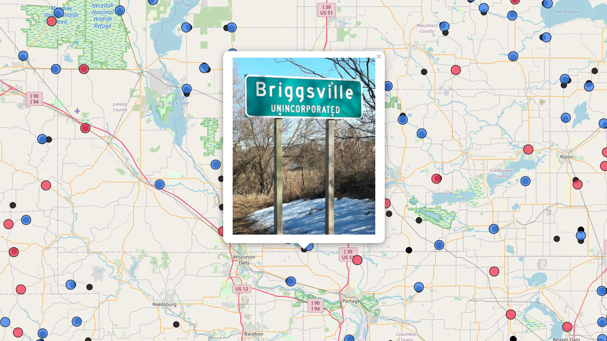

# Tutorials
A collection of tutorials from the Wisconsin State Cartographer's Office.

## Making a Web Map with Leaflet in One Minute

The first part in a there part video presentation called *Making a webmap in 1 minute, 1 hour, and 10 hours*. In this part we create a web map using Leaflet in "one minute". This is a bit misleading as preparing the data, making decisions on styling and whatnot takes more than a minute. However, it is not unreasonable to assume a lot of this code is shared between projects and therefore mostly comprised of template code chunks with minor customization. If you move through this tutorial quickly enough, it can be done in a minute.

Topics covered:
- Create blank map with basemap
- Add geojson data as points
- Color points based on category
- Click for photo in popup
