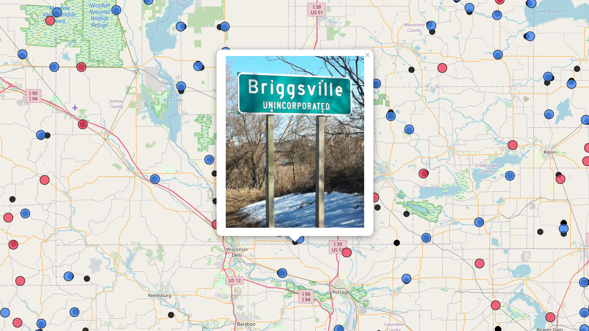

# Making a Web Map with Leaflet in One Minute



In this tutorial our goal is to create a web map using Leaflet in "one minute". This is a bit misleading as preparing the data, making decisions on styling and whatnot takes more than a minute. However, it is not unreasonable to assume a lot of this code is shared between projects and therefore mostly comprised of template code chunks with minor customization. If you move through this tutorial quickly enough, it can be done in about minute.

## To Do List

- Create blank map with basemap
- Add data as points
- Color points based on category
- Click for photo in popup


## Create Empty Map

Start by creating an html document with the following code:

```html
<!DOCTYPE html>
    <head>
        <title>Vanishing WI - One Minute</title>
        <style>
            body {
                margin: 0;
            }
            #map {
                height: 100vh;
            }
        </style>
    </head>
    <body>
        <!-- Map -->
        <div id="map"></div>
    </body>
</html>
```

Add Leaflet libraries to head:

```html
<!-- Leaflet -->
<link rel="stylesheet" href="https://unpkg.com/leaflet@1.7.1/dist/leaflet.css" integrity="sha512-xodZBNTC5n17Xt2atTPuE1HxjVMSvLVW9ocqUKLsCC5CXdbqCmblAshOMAS6/keqq/sMZMZ19scR4PsZChSR7A==" crossorigin=""/>
<script src="https://unpkg.com/leaflet@1.7.1/dist/leaflet.js" integrity="sha512-XQoYMqMTK8LvdxXYG3nZ448hOEQiglfqkJs1NOQV44cWnUrBc8PkAOcXy20w0vlaXaVUearIOBhiXZ5V3ynxwA==" crossorigin=""></script>
```

And initialize the map class using the `setView()` method and add a `tileLayer` class to the map:

```html
<script>
    // Set max view
    const maxView = L.latLngBounds(
        L.latLng(43.2161, -88.5086),
        L.latLng(42.8286, -89.0455)
    );

    // Set initial map view
    const map = L.map('map',{
        minZoom: 11,
        maxZoom: 18,
        maxBounds: maxView
    }).setView([43.0224,-88.7770], 11);

    // OSM Basemap
    const osm = L.tileLayer('https://{s}.tile.openstreetmap.org/{z}/{x}/{y}.png', {
        maxZoom: 18
    }).addTo(map);  
</script>
```

Your code should now look like the following:

```html
<!DOCTYPE html>
    <head>
        <title>Vanishing WI - One Minute</title>

        <!-- Leaflet -->
        <link rel="stylesheet" href="https://unpkg.com/leaflet@1.7.1/dist/leaflet.css" integrity="sha512-xodZBNTC5n17Xt2atTPuE1HxjVMSvLVW9ocqUKLsCC5CXdbqCmblAshOMAS6/keqq/sMZMZ19scR4PsZChSR7A==" crossorigin=""/>
        <script src="https://unpkg.com/leaflet@1.7.1/dist/leaflet.js" integrity="sha512-XQoYMqMTK8LvdxXYG3nZ448hOEQiglfqkJs1NOQV44cWnUrBc8PkAOcXy20w0vlaXaVUearIOBhiXZ5V3ynxwA==" crossorigin=""></script>

        <style>
            body {
                margin: 0;
            }
            #map {
                height: 100vh;
            }
        </style>
    </head>
    <body>
        <!-- Map -->
        <div id="map"></div>

        <script>
            // Set max view
            const maxView = L.latLngBounds(
                L.latLng(43.2161, -88.5086),
                L.latLng(42.8286, -89.0455)
            );

            // Set initial map view
            const map = L.map('map',{
                minZoom: 11,
                maxZoom: 18,
                maxBounds: maxView
            }).setView([43.0224,-88.7770], 11);
        
            // OSM Basemap
            const osm = L.tileLayer('https://{s}.tile.openstreetmap.org/{z}/{x}/{y}.png', {
                maxZoom: 18
            }).addTo(map);  
        </script>
    </body>
</html>
```

## Add Unincorporated Places

Using the `data.js` file that we prepared in advance, we can first load the file in the head of our document:

```html
<!-- Data -->
<script src="js/data.js"></script>
```

Then we can add the data to the map using the `geoJSON()` method after the section in which we load the basemap:

```js
// Add Unincs
L.geoJSON(data).addTo(map);
```

These markers are not particularly useful so let's change the symbology to circles and assign colors based on the `STATUS` property: 


```js
// Add Unincs
const legend = {
    "Uninc Found": "#4287f5",  //blue
    "Uninc Not Found": "#f54260"  //red 
}

L.geoJSON(data, {
    pointToLayer: function (feature, latlng){
        return L.circleMarker(latlng, {
            radius: 10,
            fillColor: legend[feature.properties.STATUS],
            color: "#000",
            weight: 1,
            opacity: 1,
            fillOpacity: 0.8
        });
    }
}).addTo(map);
```

It would be nice to be able to click on a feature to find out more. Let's add a popup with the feature `NAME` and `STATUS`. Add the following to the `geoJSON()` options:

```js
onEachFeature: function (feature, layer) {
    layer.bindPopup('<h1>'+feature.properties.NAME+'</h1><p>'+feature.properties.STATUS+'</p>');
}
```

## Add Photo Points

Similar to the Uninc data we can add photos as circle markers and add a popup that shows the photo.

First add `photos.js` to the head:

```html
<script src="js/photos.js"></script>
```

Add the following styling for the image popups:

```css
.leaflet-popup-content {
    width: 300px;
}
.leaflet-popup-content img {
    width: 100%;
}
```

Then add the following the the script block above the `// Add Unics` section so that the photo markers are rendered underneath the unic markers:

```js
// Add photos
const photoStyle = {
    radius: 6,
    fillColor: "#000",
    color: "#000",
    weight: 1,
    opacity: 1,
    fillOpacity: 0.8
};

L.geoJSON(photos, {
    pointToLayer: function (feature, latlng){
        return L.circleMarker(latlng, photoStyle);
    },
    onEachFeature: function (feature, layer) {
        layer.bindPopup('<a href="photos/'+feature.properties.PHOTONAME+'" target="_blank"></a>');
    }
}).addTo(map);
```

## Conclusion

Your finished map should look like the following:

```html
<!DOCTYPE html>
    <head>
        <title>Vanishing WI - One Minute</title>

        <!-- Leaflet -->
        <link rel="stylesheet" href="https://unpkg.com/leaflet@1.7.1/dist/leaflet.css" integrity="sha512-xodZBNTC5n17Xt2atTPuE1HxjVMSvLVW9ocqUKLsCC5CXdbqCmblAshOMAS6/keqq/sMZMZ19scR4PsZChSR7A==" crossorigin=""/>
        <script src="https://unpkg.com/leaflet@1.7.1/dist/leaflet.js" integrity="sha512-XQoYMqMTK8LvdxXYG3nZ448hOEQiglfqkJs1NOQV44cWnUrBc8PkAOcXy20w0vlaXaVUearIOBhiXZ5V3ynxwA==" crossorigin=""></script>

        <!-- Data -->
        <script src="js/data.js"></script>
        <script src="js/photos.js"></script>

        <style>
            body {
                margin: 0;
            }
            #map {
                height: 100vh;
            }
            .leaflet-popup-content {
                width: 300px;
            }
            .leaflet-popup-content img {
                width: 100%;
            }
        </style>
    </head>
    <body>
        <!-- Map -->
        <div id="map"></div>

        <script>
            // Set max view
            const maxView = L.latLngBounds(
                L.latLng(43.2161, -88.5086),
                L.latLng(42.8286, -89.0455)
            );

            // Set initial map view
            const map = L.map('map',{
                minZoom: 11,
                maxZoom: 18,
                maxBounds: maxView
            }).setView([43.0224,-88.7770], 11);
        
            // OSM Basemap
            const osm = L.tileLayer('https://{s}.tile.openstreetmap.org/{z}/{x}/{y}.png', {
                maxZoom: 18
            }).addTo(map); 

            // Add photos
            const photoStyle = {
                radius: 6,
                fillColor: "#000",
                color: "#000",
                weight: 1,
                opacity: 1,
                fillOpacity: 0.8
            };

            L.geoJSON(photos, {
                pointToLayer: function (feature, latlng){
                    return L.circleMarker(latlng, photoStyle);
                },
                onEachFeature: function (feature, layer) {
                    layer.bindPopup('<a href="photos/'+feature.properties.PHOTONAME+'" target="_blank"></a>');
                }
            }).addTo(map);
            
            // Add Unincs
            const legend = {
                "Uninc Found": "#4287f5",  //blue
                "Uninc Not Found": "#f54260"  //red 
            }

            L.geoJSON(data, {
                pointToLayer: function (feature, latlng){
                    return L.circleMarker(latlng, {
                        radius: 10,
                        fillColor: legend[feature.properties.STATUS],
                        color: "#000",
                        weight: 1,
                        opacity: 1,
                        fillOpacity: 0.8
                    });
                },
                onEachFeature: function (feature, layer) {
                    layer.bindPopup('<h1>'+feature.properties.NAME+'</h1><p>'+feature.properties.STATUS+'</p>');
                }
            }).addTo(map);
        </script>
    </body>
</html>
```
